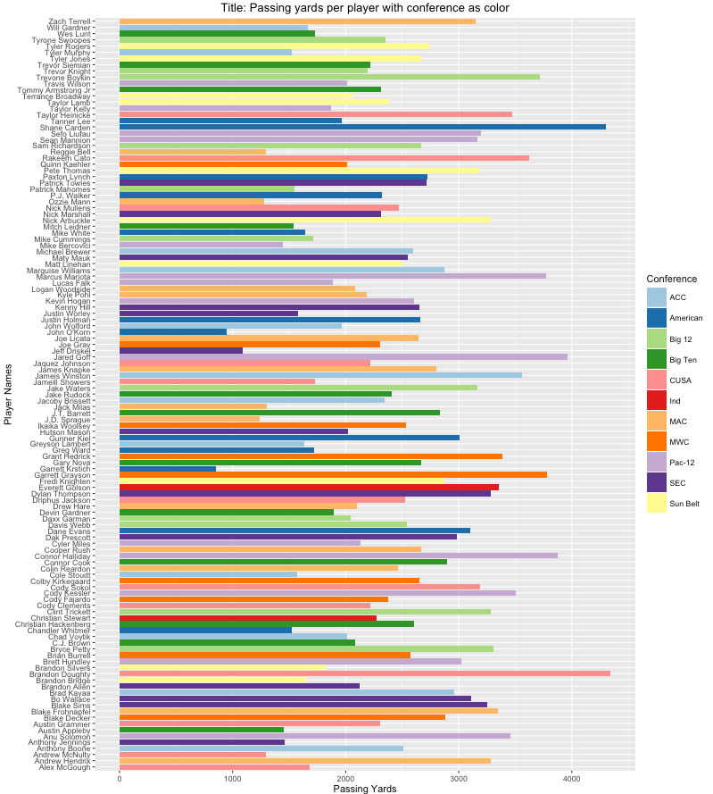

## ICW2: Football data analysis
---------------------------------------------------
__Team Members:__ Srinivas Havanur; Erika Siregar; Hung Do

__Assignment:__ ICW2: Football data analysis

__Course:__ Information Visualization

__Semester:__ Spring 2016

---------------------------------------------------
###1.Scatterplot matrix of passing yards, passing TDs, passer rating, rushing yards, and rushing TDs


Embedding R code in Markdown:

```R
# Scatterplot Matrices
sn <- read.csv("passing-stats-2014.csv", header =T)

# subset data
# Should clean spaces in headings of data
data <- sn[,c("PassingYards","PassingTD","Rate","RushingYards","RushingTD")]

#Pairing data into matrix with three different colors
pairs(data,main = "Title: Performance of Football Player in Scatter Plot Matrix",pch = 21, bg = c("red", "green3", "blue") )

```
---------------------------------------------------

###2. Bar chart of passing yards per player (best displayed as a horizontal bar chart), with conference as color


Embedding R code in Markdown:

```R
#Load the csv file using file browse option.
sports <- read.csv(file.choose(), header=TRUE, sep=",")

#It is a package that includes set of functions that attempt to streamline the process for creating predictive models. ggplot is one of the functions in that package. 
library(caret)

#Graph is plotted using ggplot having horizontal bar chart option to represent PassingYards per player.
ggplot(sports, aes(x=sports$Player, y=sports$PassingYards, fill=sports$Conf)) + geom_bar(stat="identity") + coord_flip() + labs(x="Player Names",y="Passing Yards",fill="Conference") + ggtitle("Title: Passing yards per player with conference as color") +  scale_fill_brewer(palette="Paired")
```

###3. Bar chart of the average of one of the statistics for each conference
a) Without Color Code:


Embedding R code in Markdown:

```R

#Load the csv file using file browse option.
sports <- read.csv(file.choose(), header=TRUE, sep=",")

# This library is loaded to perform groupby summary statistics.
library(doBy)

#It is a package that includes set of functions that attempt to streamline the process for creating predictive models. ggplot is one of the functions in that package. 
library(caret)

#This is used to calculate average of PassingAttempts per conference.
sports_filtered_avg=summaryBy(PassingAttempts ~ Conf, data = sports,FUN = list(mean))

#Graph is plotted using ggplot to represent a bar graph having average of PassingAttempts per conference.
ggplot(sports_filtered_avg, aes(sports_filtered_avg$Conf,sports_filtered_avg$PassingAttempts.mean)) + geom_bar(stat="identity", fill="steelblue") + labs(x="Conference", y="Avg Value of Passing Attempts") + ggtitle("Title: Avg of PassingAttempts statistics for each Conference")

```
b) With Color Code:

Embedding R code in Markdown:

```R

#Load the csv file using file browse option.
sports <- read.csv(file.choose(), header=TRUE, sep=",")

# This library is loaded to perform groupby summary statistics.
library(doBy)

#It is a package that includes set of functions that attempt to streamline the process for creating predictive models. ggplot is one of the functions in that package. 
library(caret)

#This is used to calculate average of PassingAttempts per conference.
sports_filtered_avg=summaryBy(PassingAttempts ~ Conf, data = sports,FUN = list(mean))

#Graph is plotted using ggplot to represent a bar graph having average of PassingAttempts per conference with different color code.
ggplot(sports_filtered_avg, aes(sports_filtered_avg$Conf,sports_filtered_avg$PassingAttempts.mean, fill=sports_filtered_avg$Conf)) + geom_bar(stat="identity") + labs(x="Conference", y="Avg Value of Passing Attempts", fill="Conference") + ggtitle("Title: Avg of PassingAttempts statistics for each Conference") + scale_fill_brewer(palette="Paired")

```

